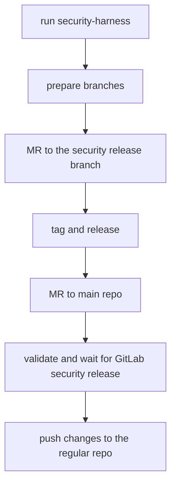

# Security Releases

This guide is based on the main [`gitlab-org/gitlab-vscode-extension` security release process](https://gitlab.com/gitlab-org/gitlab-vscode-extension/-/blob/main/docs/developer/security-releases.md)

## DO NOT PUSH TO `gitlab-org/gitlab-web-ide`

As a developer working on a fix for a security vulnerability, your main concern is not disclosing the vulnerability or the fix before we're ready to publicly disclose it.

To that end, you'll need to be sure that security vulnerabilities are fixed in the [Security Repo](https://gitlab.com/gitlab-org/security/gitlab-web-ide).

This is fundamental to our security release process because the [Security Repo](https://gitlab.com/gitlab-org/security/gitlab-web-ide) is not publicly-accessible.

## Process

A security fix starts with an issue identifying the vulnerability. This may be either in the main `gitlab-org/gitlab` project or the `gitlab-org/gitlab-web-ide` project.

Once a security issue is assigned to a developer, we follow the same merge request and code review process as any other change, but on the [Security Repo](https://gitlab.com/gitlab-org/security/gitlab-web-ide).

### Schema



### Preparation

Before starting, add the new `security` remote on your local GitLab repository:

```sh
git remote add security git@gitlab.com:gitlab-org/security/gitlab-web-ide.git
```

Finally, run the `scripts/security-harness.js` script. This script will install a Git `pre-push` hook that will prevent pushing to any remote besides `gitlab.com/gitlab-org/security`, in order to prevent accidental disclosure.

Please make sure the output of running `scripts/security-harness.js` is:

```
Security harness installed -- you will only be able to push to gitlab.com/gitlab-org/security!
```

### Branches

The main objective is to release the security fix as a patch of the latest production release and backporting this fix on `main`.

#### Patch release branch

Before starting the development of the fix, do the following:

1. In the GitLab UI, find the latest released tag by checking the [commits](https://gitlab.com/gitlab-org/security/gitlab-web-ide/-/commits/main)
   or [tags](https://gitlab.com/gitlab-org/security/gitlab-web-ide/-/tags).
   If the security project is outdated, you may need to trigger an update through the GitLab UI.
1. In the GitLab UI, [create a security branch](https://gitlab.com/gitlab-org/security/gitlab-web-ide/-/branches/new) based on the latest released tag.
   For example, if the latest released tag is `0.0.1-dev-20230524134151`, create a branch in the security project with:
   - **Branch name:** `security-release-0.0.1-dev-20230524134151`
   - **Create from:** `0.0.1-dev-20230524134151`.

This new branch will be the target of the security MRs.

Note: It's important to use the `security-release-` prefix since this will make a **protected** branch in the security project.

#### Security fix branch

Your fix will be pushed into a `security-<issue number>` branch. If you work on issue #9999, you push the fix into `security-9999` branch.

```sh
git fetch security
git checkout security-release-0.0.1-dev-20230524134151
git checkout -b security-9999
git push security security-9999
```

### Development

1. **Before developing the fix, make sure that you've already run the `scripts/security-harness.js` script.**
1. Implement the fix and push it to your branch (`security-9999` for issue #9999).
1. Create an MR to merge `security-9999` to the patch release branch (`security-release-0.0.1-dev-20230524134151`) and get it reviewed.
1. Merge the fix (make sure you squash all the MR commits into one).

### Release the change

**Note:** Since we have not implemented semantic versioning of the package yet, we are adding `-patch-` to the end of
the base version for security patches. For example, if we're developing a security patch release for the tag `0.0.1-dev-20230524134151` the security patch release should be tagged
`0.0.1-dev-20230524134151-patch-1`.

1. Make sure the relevant `security-release-` branch is ready to be released with all relevant changes merged.
1. Start a new pipeline on the relevant `security-release-` branch with the following CI/CD job variables:
   - **GITLAB_WEB_IDE_VERSION:** The patch release version, for example `0.0.1-dev-20230524134151-patch-1`
1. Wait for the pipeline to complete.
1. Run the `publish-development-package` manual job with the following CI/CD job variables:
   - **NPM_PUBLISH_TAG:** `dev`. Please note, the `NPM_PUBLISH_TAG` must not be `latest` (the default value) so that the security release is not picked up by renovate bot prematurely.
1. [Create a tag](https://gitlab.com/gitlab-org/security/gitlab-web-ide/-/tags/new) in the GitLab UI for the security patch version that was just published
   - **Tag name:** Use the version of the security patch that was just published. This should be the same as the `GITLAB_WEB_IDE_VERSION` used to start the pipeline.
   - **Create from:** The commit sha of the `HEAD` of the relevant `security-release-` branch.
   - **Message:** Add a link to the newly published `npmjs` package in `https://www.npmjs.com/package/@gitlab/web-ide`

### Create GitLab Security Merge Requests

**IMPORTANT:** You must ensure that the latest WebIDE version is backwards compatible with all three versions.
For example, you should check if any of the [related WebIde config interfaces](https://gitlab.com/gitlab-org/gitlab-web-ide/-/blob/main/packages/web-ide-types/src/config.ts#L28) have changed in a breaking way.

Follow the [security development process](https://gitlab.com/gitlab-org/release/docs/-/blob/master/general/security/developer.md) on the main GitLab project,
updating the `@gitlab/web-ide` version to the latest patched release in each vulnerable GitLab version.

For example, if the following GitLab version referenced these `@gitlab/web-ide` versions, which were all determined vulnerable to the relevant security issue:

| GitLab Version | `@gitlab/web-ide` reference |
| -------------- | --------------------------- |
| %15.11         | `0.0.1-dev-20230323132525`  |
| %16.0          | `0.0.1-dev-20230418150125`  |
| %16.1          | `0.0.1-dev-20230524134151`  |

And a `0.0.1-dev-20230524134151-patch-1` version was released to resolve the security issue (see previous steps), then we'll create security backport MR's
(following the [security development process](https://gitlab.com/gitlab-org/release/docs/-/blob/master/general/security/developer.md)) to update the versions to:

| GitLab Version | `@gitlab/web-ide` reference        |
| -------------- | ---------------------------------- |
| %15.11         | `0.0.1-dev-20230524134151-patch-1` |
| %16.0          | `0.0.1-dev-20230524134151-patch-1` |
| %16.1          | `0.0.1-dev-20230524134151-patch-1` |

## Push changes back to the [Web IDE repo](https://gitlab.com/gitlab-org/gitlab-web-ide)

**IMPORTANT:** Do not perform this step until the GitLab Security Merge Requests have been merged **and released.** We must keep the security issue
confidential until the relevant GitLab versions are patched and new versions are released.

1. [Create an MR](https://gitlab.com/gitlab-org/security/gitlab-web-ide/-/merge_requests/new?merge_request%5Bsource_project_id%5D=47566511&merge_request%5Bsource_branch%5D=&merge_request%5Btarget_project_id%5D=35104827&merge_request%5Btarget_branch%5D=main) from the security project:
   - **Source project:** `gitlab-org/security/gitlab-web-ide`
   - **Source branch:** The patch release branch (for example `security-release-0.0.1-dev-20230524134151`)
   - **Target project:** `gitlab-org/gitlab-web-ide`
   - **Target branch:** `main`
1. Merge the MR. No review is necessary since the changes have already been
   reviewed.

## Questions

### What about Request CVE Number step referenced in the VSCode project?

The [Request CVE Number](https://gitlab.com/gitlab-org/gitlab-vscode-extension/-/blob/main/docs/developer/security-releases.md#request-cve-number) section
cannot apply to the Web IDE project yet since we do not publish a CHANGELOG.

### What if I need to patch a historic version of `gitlab-web-ide`?

This is relevant if a security issue is identified in a past version of GitLab which references an old version of `gitlab-web-ide`. In this case, we have two options:

- Create a patch for that **historic** verison of `gitlab-web-ide` and update the GitLab `package.json` to reference this new patch in a GitLab security MR.
- Create a patch for the **latest** version of `gitlab-web-ide` and update the GitLab `package.json` to reference this latest version in a GitLab security MR.

For now, we will prefer the second option, updating old versions of GitLab to point to the latest `gitlab-web-ide` version. This helps us be more efficient without
managing multiple patch releases across multiple versions.

It's possible this won't work out in some future scenario. In this case, we'll adapt the process to follow the first option, creating patch releases for each
`gitlab-web-ide` version referenced by each vulnerable GitLab release.
