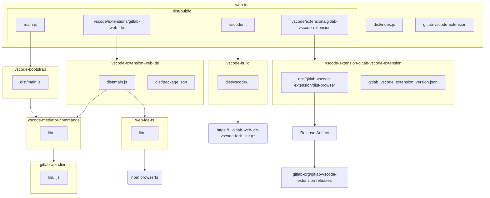
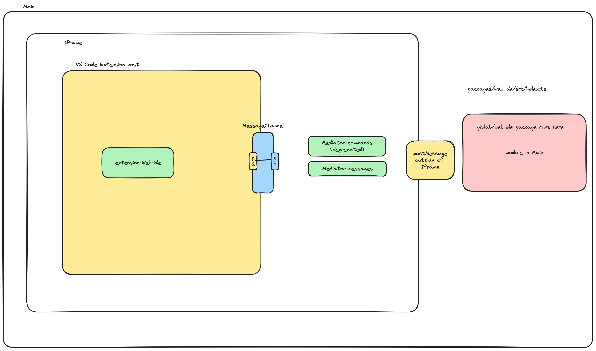

# Architecture packages



## Main package

This package produces the main artifact of this repository.

### `web-ide`

The main artifact of the `web-ide` repository is the `@gitlab/web-ide` npm package,
which can be generated by running:

```shell
./scripts/pack-web-ide-package.sh
```

This artifact has 2 key parts:

- `dist/index.js`, which is the main export of the package and provides methods
  for initializing the GitLab Web IDE. It's expected that this module is simply
  imported like a normal npm package module:

  ```javascript
  import { start } from '@gitlab/web-ide';

  start(...);
  ```

  This module is bundled so that we can use unpublished workspace dependencies.

- `dist/public/...`, which contains assets that should be self-hosted by the client.
  It's **not** expected for these assets to be transpiled by the
  client. They should be hosted as-is. If you're using webpack, this
  can be done with `CopyWebpackPlugin`
  (see [the main GitLab project for an example](https://gitlab.com/gitlab-org/gitlab/-/blob/a35dcacbc43060de1e08c7e559d6cc864e68570b/config/webpack.config.js#L663)).
  These self-hosted assets include:
  - `vscode/...`, which is the VS Code browser build. This comes from the
    [`vscode-build`](../../packages/vscode-build/) internal package,
    which uses an artifact from the [`gitlab-web-ide-vscode-fork`](https://gitlab.com/gitlab-org/gitlab-web-ide-vscode-fork) project.
  - `vscode/extensions/gitlab-web-ide/...`, which is the main VS Code
    extension that powers the GitLab Web IDE environment. These assets
    are produced in the [`vscode-extension-web-ide`](../../packages/vscode-extension-web-ide/) internal package.
  - `main.js`, which is the entry point that reads the configuration
    provided by the `@gitlab/web-ide` client, loads the necessary
    self-hosted VSCode assets, and starts the VS Code workbench based
    on the given configuration. This module is produced in the [`vscode-bootstrap`](../../packages/vscode-bootstrap/)
    internal package.

**Should `@gitlab/web-ide` have any dependencies?**

No.

Any dependencies here would become transitive dependencies of `@gitlab/web-ide` clients.

Because this package is the only one that is actually published, it should **not**
depend on any internal packages of this repository. This would cause issues
when clients try to install the `@gitlab/web-ide` package from npm.

## VS Code packages

These are packages that relate to the VS Code architecture of the GitLab
Web IDE.

### `vscode-build`

The `vscode-build` internal package is used to provide a browser build of VS Code.

The browser build itself is **not** checked into source control. Instead,
the assets are downloaded based on the location specified in
[`vscode_version.json`](../../packages/vscode-build/vscode_version.json).

The main artifact of this package is:

- `dist/vscode/...`, which contains the extracted VS Code assets specified
  in `vscode_version.json`.

### `vscode-bootstrap`

The `vscode-bootstrap` internal package is responsible for interfacing
with VS Code [internal API](https://sourcegraph.com/github.com/microsoft/vscode@f5fdf679b8d22a0dd0dcb6fd8e3bc96bbeb99f75/-/blob/src/vs/workbench/browser/web.api.ts?L129)
to bootstrap the VS Code workbench based on the configuration provided
in the main `@gitlab/web-ide` package.

It's expected that this initialization needs to happen in an iframe, so
this package produces a module that can be included as a `<script>` in the
iframe (not imported as a module directly).

The main artifact of this package is:

- `dist/main.js`, which is copied to the main `@gitlab/web-ide` package.
  `@gitlab/web-ide` automatically loads this script into the
  iframe it creates for the GitLab Web IDE instance.

### `vscode-mediator-commands`

The `vscode-mediator-commands` package is responsible for providing a set
of message handlers needed by `vscode-extension-web-ide` and initialized
by `vscode-bootstrap` which have to run **outside** the VSCode extension sandbox.

The GitLab Web IDE has 3 runtime environments:

- `Main`: the main runtime environment that imports and runs the
  `@gitlab/web-ide` package.
- `Iframe`: the iframe environment created by `@gitlab/web-ide`,
  which loads and initiailizes the `vscode` assets.
- `VSCode Extension`: the VS Code extension environment, which has access
  to [VS Code extension API](https://code.visualstudio.com/api/references/vscode-api)
  but is in a sandbox and blocked from directly reading or writing to the DOM API.

**Diagram:**

<details>
<summry>Diagram</summary>



</details>

**Deprecated behavior:**

- The `vscode-mediator-commands` package creates a set of commands that can
  be **triggered** from the `VSCode Extension` runtime environment but are
  **executed** in the `Iframe` runtime environment. This means that web
  requests naturally use the `Main` cookie and the command can
  have full access to the provided configuration.
- **Please note:** This is no longer needed after moving to OAuth and we are working towards
  removing this behavior once we can remove the [`web_ide_oauth`](https://gitlab.com/gitlab-org/gitlab/-/issues/433324)
  feature flag.

**What qualifies something to live in `vscode-mediator-commands` instead of `vscode-extension-web-ide`?**

- The need to communicate within the `Main` environment. For example,
  the `ready` message handler uses [`postMessage`](https://developer.mozilla.org/en-US/docs/Web/API/Window/postMessage)
  to notify the `Main` environment when it's ready.
- **Deprecated:** The need to share authentication context of the `Main` environment.
  For example, the `fetch-file-raw` command uses `gitlab-api-client`.
  For a seamless user experience, that command should use the cookies
  of the `Main` environment.

### `vscode-extension-web-ide`

The `vscode-extension-web-ide` internal package is responsible for
providing the assets for the custom built-in VS Code extension that
creates the GitLab Web IDE experience.

This package owns the interactions with the [VS Code extension API](https://code.visualstudio.com/api/references/vscode-api).
For the most part, it provides custom UI through VS Code API or acts as
the glue code between cohesive decoupled packages like `web-ide-fs` and
VS Code API.

The main artifacts of this package are:

- `dist/main.js`, which is a transpiled and bundled entry point module for
  the VS Code extension. VS Code automatically loads this module and
  calls the `activate` method during its initialization.
- `dist/package.json`, which contains the necessary VS Code extension
  metadata including declaring [VS Code contributions](https://code.visualstudio.com/api/references/contribution-points).

### `vscode-extension-gitlab-vscode-theme`

The `vscode-extension-gitlab-vscode-theme` package contains the source for the GitLab
[VSCode Color theme](https://code.visualstudio.com/api/extension-guides/color-theme)
extension. This color theme extension is built into the Web IDE, and it is also
published to extension marketplaces.

### `vscode-extension-gitlab-vscode-extension`

The `vscode-extension-gitlab-vscode-extension` internal package is used to provide a browser build of the GitLab VS Code extension.

The browser build itself is **not** checked into source control. Instead,
the assets are downloaded based on the location specified in
[`gitlab_vscode_extension_version.json`](../../packages/vscode-extension-gitlab-vscode-extension/gitlab_vscode_extension_version.json).

The main artifact of this package is:

- `dist/gitlab-vscode-extension/dist-browser...`, which contains the extracted GitLab VS Code extension assets specified
  in `gitlab_vscode_extension_version.json`.

### `web-ide-interop`

This package contains types that are shared with other projects (namely the Workflow extension).
Other projects can interact with the Web IDE through:

- `extensions.getExtension('gitlab.gitlab-web-ide')` which returns the `WebIDEExtension` type.
- **Deprecated:** Using mediator commands which are scheduled to be removed once the
  [`web_ide_oauth`](https://gitlab.com/gitlab-org/gitlab/-/issues/433324) feature flag is removed.

Changing these types has to happen in all dependent projects at the same time to avoid breaking the contract.

## Library packages

These are library packages that provide cohesive functionality that is
decoupled from and not dependent on VS Code or any other Web IDE
architectural concern.

### `gitlab-api-client`

This internal package contains the types and functions associated
with communicating to a GitLab instance through its REST API.

```typescript
import { DefaultGitLabClient, gitlabApi } from '@gitlab/gitlab-api-client';

const client = new DefaultGitLabClient({ baseUrl: '...' });
const request = gitlabApi.getProjectBranch.createRequest({
  projectId: '...',
  branchName: '...',
});
const branch = await client.fetchFromApi(request);
```

### `web-ide-fs`

This package is responsible for providing the types and default
implementation for the filesystem that powers the Web IDE.

This package should be decoupled from VS Code specifics.

**How is this related to BrowserFS?**

Under the hood, this package uses an [OverlayFS](https://jvilk.com/browserfs/1.4.1/modules/_backend_overlayfs_.html)
provided by [BrowserFS](https://jvilk.com/browserfs/1.4.1/) to make
tracking changes easier.

This package should **not** expose BrowserFS details in its interface.
Instead, BrowserFS is an implementation detail that is adapted to
conform to an [`IFileSystem`](../../packages/web-ide-fs/src/types.ts)
provided by this package.

## Related topics

- [`gitlab-web-ide` architecture](https://youtu.be/-hnpY4UObZg)
- [Open Remote Development from the client only](https://youtu.be/blsVwJtpkOs)
