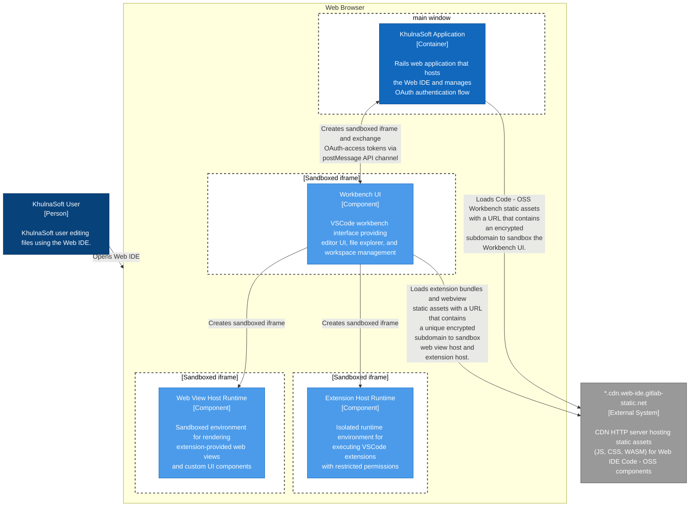
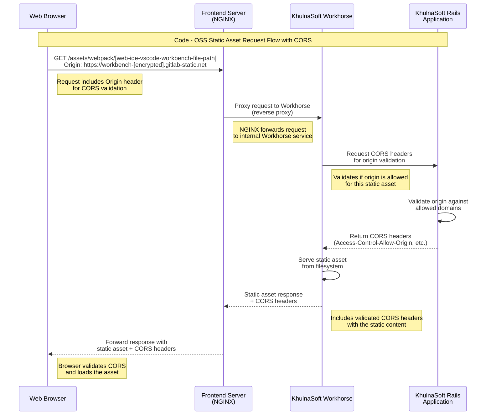

# Web IDE deployment architecture

This document describes the deployment architecture of the Web IDE.

## Background

The Web IDE is a web-based source code editor and source control client built on top
of the [Visual Studio Code - Open Source (Code - OSS)](https://github.com/microsoft/vscode)
project. As a result, the Web IDE inherited key architectural characteristics and powerful
features from this upstream project. We'll refer to the upstream project as `Code - OSS` from
now on.

## Multi origin architecture

The Web IDE, just like `Code - OSS`, can run 3rd-party code via extensions that users can
install at will. This powerful feature also poses a significant security challenge because
we need to ensure that unverified 3rd-party code doesn't have unrestricted access to a KhulnaSoft user
account. The Web IDE also inherits code sandbox architecture from `Code - OSS` that isolates
3rd-party code using the web browser's [same origin policy](https://developer.mozilla.org/en-US/docs/Web/Security/Same-origin_policy).

The web browser's same origin policy doesn't allow javascript loaded in a document
linked to origin (e.g. `bar.com`) to access another document or data storage linked to
a different origin (e.g. `foo.com`). Two documents have the same origin if their URLs
share the same protocol, port, and domain name.

To leverage this code sandboxing architecture, the Web IDE **requires** that the
http server that hosts the `Code - OSS` static assets (.html, .js, .wasm, and so on)
is reachable using a **wildcard domain name** like `*.web-ide.net` where the `*`
placeholder can be any valid domain name segment. The Web IDE will generate unique
subdomains for sandbox three documents or execution contexts:

1. The `Code - OSS` Workbench that represents the core source code
   editor functionality.
1. The Extension host that runs 3rd-party extensions.
1. The Web View host that runs another form of 3rd-party code called
   [web views](https://code.visualstudio.com/api/extension-guides/webview).

## Deploying the Web IDE

By default, every KhulnaSoft instance uses a CDN provided by the KhulnaSoft organization
that hosts `Code - OSS` static assets and it's reachable using the wildcard domain name
`*.cdn.web-ide.gitlab-static.net`. This default setup removes the necessity of setting
up a wildcard domain for KhulnaSoft Self-Managed instances.

The following diagram visualizes how the web browser uses the KhulnaSoft application
server and the `*.cdn.web-ide.gitlab-static.net` to initialize the Web IDE, built-in
extensions, and web views. **All the interactions between these components happen
exclusively on the client-side**.

### Air-gapped instances

KhulnaSoft instances running on air-gapped/offline environments don't have access to the
`*.cdn.web-ide.gitlab-static.net` assets host. In this scenario, the GitLab
to set up a custom wildcard domain. Go to the KhulnaSoft administrator documentation to learn
how to set up a custom wildcard domain for the Web IDE **(pending)**.

The following sequence diagram describes how the KhulnaSoft instance serves `Code - OSS` static
assets after setting up a custom wildcard domain:

The main requirement for using the KhulnaSoft instance as a Web IDE assets host is
configuring the frontend server of choice to accept HTTP traffic from a wildcard
domain and providing a TLS certificate. The KhulnaSoft instance will know how to
infer CORS rules to ensure that `Code - OSS` assets are used in a secure context.
