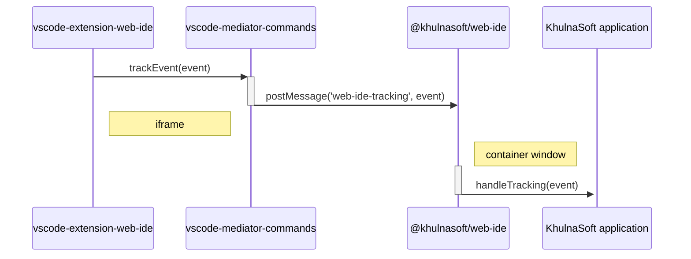

# Instrumentation

[TOC]

The Web IDE sends tracking events to [KhulnaSoft snowplow service](https://docs.gitlab.com/ee/development/snowplow/implementation.html)
. The Web IDE doesn’t connect to Snowplow, but allows passing a `handleTracking` function to the `start` or `startRemote`
functions exported by the [web-ide package](./architecture-packages.md#web-ide).

```typescript
import { start } from '@khulnasoft/web-ide';

start({
  handleTracking: (trackingEvent: TrackingEvent) {
    // Invoke snowplow service
  }
})
```

The `TrackingEvent` type contains two properties: A string `name` that identifies the event and `data` which
contains extra information that varies across events.

## Tracking sources

Tracking events come from the [Web IDE VSCode extension](./architecture-packages.md#vscode-extension-web-ide). These packages send tracking messages
that contain one tracking event.

The Web IDE sends these events from inside the iframe to the container window
using the `postMessage` api. The `web-ide` package listen to the `iframe`’s `message`
event and calls `handleTracking` when receiving a message with jey `web-ide-tracking`

### Web IDE VSCode extension

The Web IDE sends tracking events using the `trackEvent` mediator command.


